# Literature

## Of Human Criteria and Automatic Metrics: A Benchmark of Evaluation of Story Generation

**year, subject, code**
2022, Benchmark, https://github.com/dig-team/hanna-benchmark-asg

**background**
Automatic Story Generation (ASG) relies heavily on human and automatic evaluation.

**problem**
- there is no consensus on which human evaluation criteria to use,
- and no analysis of how well automatic criteria correlate with them.

**solution**
- they introduce a set of 6 orthogonal and comprehensive human criteria, carefully motivated by the social sciences literature.
  - Relevance (RE): how well the story matches its prompt
  - Coherence (CH): how much the story makes sense,
  - Empathy (EM): how well the reader understood the character’s emotions, derived from the importance of emotional commentary, passion , and empathy
  - Surprise (SU): how surprising the end of the story was, derived from the importance of schema violation, or unexpectedness, postdictability, and novelty
  - Engagement (EG): how much the reader engaged with the story; a more subjective criterion associated with projecting volitive modality (making the reader formulate a subjective judgment and express a desire to see something accomplished) and story outcome, which is an underlying cause of story liking
  - Complexity (CX): how elaborate the story is; derived from the importance of detailed descriptions and sophisticated problem-solving and good world-building
- they also present HANNA, an annotated dataset of 1,056 stories
  - produced by 10 different ASG systems
  - for ASG evaluation.
  - it has
    - story prompt
    - human story from the prompt
    - ai story from the prompt
    - ai model used
    - then human ratings on the 6 new criteria
- they evaluate the performance of 72 existing automatic metrics against their proposed human criteria.

**results**
- they demonstrate the limitations of current automatic evaluation methods.
- they make recommendations on which metrics to use for ASG evaluation.

**conclusion / future**
- Large pre-trained language models seem to produce the best results for ASG.
- we need automatic metrics that target each of their newly-proposed proposed human criteria.
- these newly-proposed proposed human criteria are overall weakly-correlated with one another, which shows they're non-redundant and produce coherent system rankings.
- all ASG metrics are very weak. BLEUΞ§ and ROUGEΞ§. chrFΞ§ and BARTScoreΞε are the best performers at the story- and system-level respectively.
  - The Ξ means they evaluate the candidate text by comparing it to a reference text (the human story).
  - The § means the evaluation is string-based and cannot handle synonyms, paraphrases.
  - The ε means the evaluation is embedding-based (using word2vec, BERT, etc) and can handle synonyms, paraphrases.

**summary**
- they created 6 human metrics to use for ASG. These are
- they created a dataset Human-ANnotated NArratives (HANNA),
- they tested LLMs against these metrics. How?
- they found that all LLMs tested performed poorly.

**thoughts**
- what are humans looking for when they evaluate AI stories, systems, results?
- all the tested models are OLD. Can we rerun this experiment with GPT and its friends?
- can we come up with a dataset that takes into account the 6 new criteria? or augment an existing one?

## InfoLM: A New Metric to Evaluate Summarization & Data2Text Generation
- proposes a way to fix the metrics (e.g., BLEU) that miss synonyms in evaluation. 
- they introduce InfoLM a family of untrained metrics that can be viewed as a string-based metric.
- they address the aforementioned flaws thanks to a pre-trained masked language model.
- DOI 10.1609/aaai.v36i10.21299

## Survey2Persona: Rendering Survey Responses as Personas

**year, subject, code**
2022, App/System, https://s2p.qcri.org/

**background**
personas useful for stakeholders in product and service creation.

**problem**
- creating personas is difficult

**solution**
- create them with AI
  - preserves privacy of individuals
  - allows the fine grain detail close to real people details
- use outlier detection in real-time. details unclear.
- tested with datasets:
  - “COVID-19 Beliefs, Behaviors & Norms Survey” published by MIT in collaboration with Facebook and the World Health Organization
  - “American Trends Panel Data” (AMTRENDS) from Pew Internet Research
  - an artificial dataset (ARTIFICIAL) that we created by randomly generating statements using a text generator and then randomly assigning values from the Likert range of 1-5 to 1708 unique demographic groups (i.e., each group was assigned a random value for each statement).

**results**
- Medium or high number of demographic groups = many personas are generated. Few demographics = few personas.
- The number of demographic groups is more important than the number of statements and responses.
- a decent sample size of 10,169 is not adequate to generate a high number of personas when there are only a few statements and demographic groups.
- Overall, S2P’s ability to generate personas does not appear great when there is a small number of statements or demographic groups.

**issues**
- surveys that are split by some answer choice,
- binary or other categorical answers not following the Likert scale,
- open-ended answers,
- items that do not include statements or are formulated as questions,
- latent constructs, i.e., multiple items belong to the same measure.

**conclusion / future**
- Future research is needed to define the lower boundary conditions for meaningful persona generation using S2P. currently, it only works well for large-scale survey datasets with a variety of statements (>10), demographic groups (>100)
- what should be the optimal range for information in persona profiles?
- there are issues with using mean-based SD for outlier detection, including poor performance with imbalanced (non-normal) data and small sample sizes. they're looking into MAD (mean absolute deviation)

**summary**
- generate personas from 
	- analytics data
	- survery responses themselves

**thoughts**
- can we do GroundTruthData2Personas? we get T2D healthcare data/stats and make personas from it?

## Towards Measuring and Modeling “Culture” in LLMs: A Survey
**year, subject, code**  
2024, Survey, https://github.com/faridlazuarda/cultural-llm-papers

**background**  
sample background

**problem**  
how is culture measured and modeled in LLMs?

**solution**  
survey of more than 90% of papers that aim to study culture in LLMs.

**results**
- none of the studies defines culture; attempted definitions are "broad-brush"
- others (un)knowingly define what (proxies of) culture is/are with the datasets they use.
- Culture in the Social Sciences
	- cultural heritage
	- interpersonal interactions
	- ways of life
	- in Anthropology
		- thin: as understood from outsiders perspective.
		- thick: as understood from outsiders perspective, but adds actors' own explanation of context and behaviour.
- Culture in NLP
	- Hershcovich et al. (2022)
		- common ground
		- aboutness
		- objectives and values
	- Liu et al., 2024a
		- within human
		- between humans
		- outside of human 
- studies use aspects of culture which they call proxies of culture.
	- demographic proxies: Culture is, almost always, described at the level of a community or group of people, who share certain common demographic attributes. These could be ethnicity (Masai culture), religion (Islamic culture), age (Gen Z culture), socio-economic class (middle class or urban), race, gender, language, region (Indonesian culture) and so on, and their intersections (e.g., Indian middle class).
	- semantic proxies: Often cultures are defined in terms of the emotions and values, food and drink, kinship terms, social etiquette, etc. prevalent within a group of people.
	- Note that the semantic and demographic proxies are orthogonal and simultaneously apply to any study. For instance one could choose to study the festivals (a semantic proxy) celebrated in a particular country (a demographic proxy).
- they also categorise the probing methods
	- black-box approach which only relies on the observed responses
	- white-box approach where the internal states of the models can be observed
	- Discriminative Probing, where the model chooses a specific answer from options
	- Generative Probing uses an open-ended fill-in-the-blank evaluation method. answers under different culture are compared.
- parts of culture that have been studied: objectives & values
- parts of culture that haven't been studied: multitude of semantic domains, aboutness
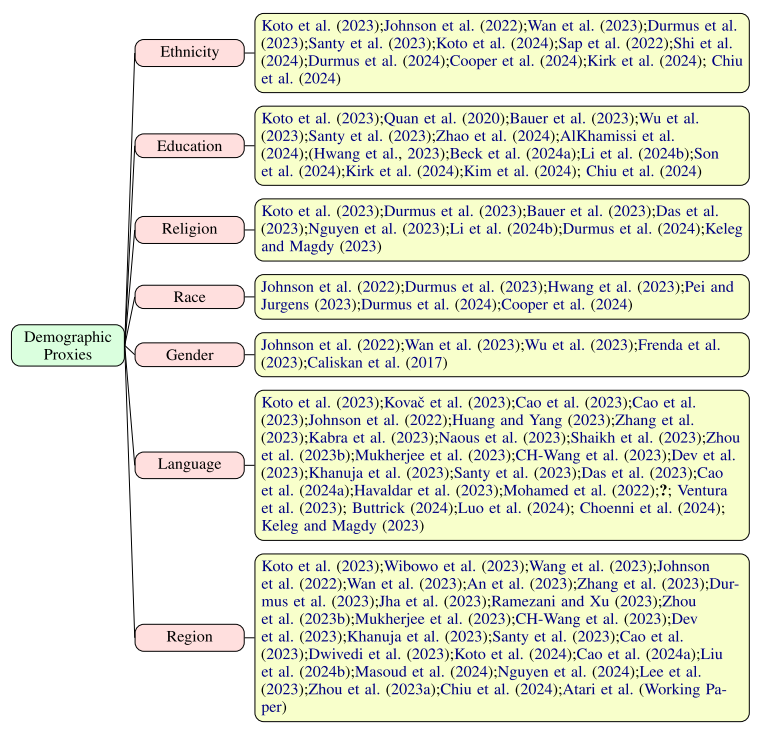
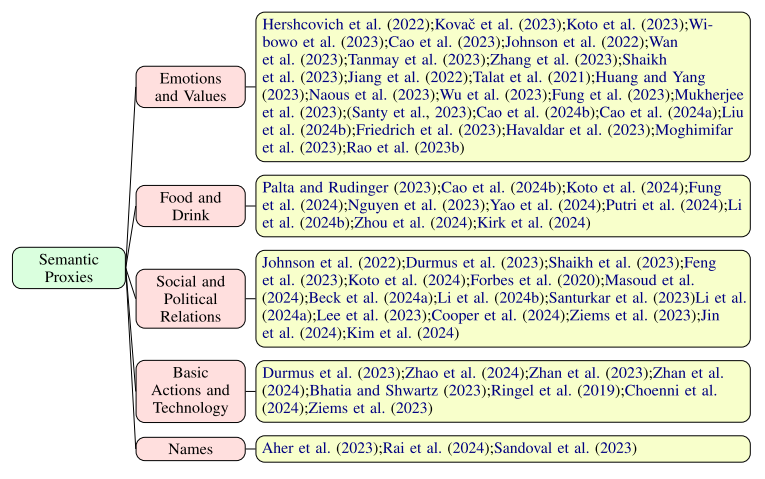
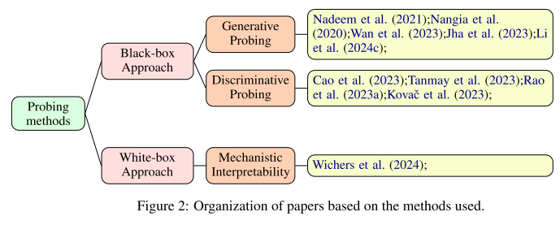

**conclusion / future**
- they point out a lack of robustness of probing techniques
- a lack of situated studies on the impact of cultural mis- and under-representation in LLM-based applications
- lack of studies that use white-box probing methods
- work on the robust and interpretable methods for culture
- need for culturally situated multilingual datasets from scratch
- consider anthropology and HCI 

**summary**  
- Overview of papers that cover culture.
- many ways of defining `culture`
- some ways of defining culture have been overly investigated, others haven't

**thoughts**
- can we explore an idea of cultural mosiac, where a person subscribes to one or more cultures at the same time, and applies one of them to specific parts of his life at specific times?

## CHAE: Fine-Grained Controllable Story Generation with Characters, Actions and Emotions
**year, subject, code**  
2022, App/System, https://github.com/victorup/CHAE

**background**  
- most work focusses on coherence based on keywords, outlines, commonsense knowledge
- other work generates stories based on emotion, style, topic

*previous story gen ideas:*
- using keywords
- using outlines
- incorporating external knowledge
- generating in specified styles using leading context
- generating stories with desired titles and protagonists' emotional arcs
- generating stories considering the changes in the psychological state, while they just control the emotion lines instead of the detailed contents.

*previous **controllable** story gen ideas:*
- CTRL can control the overall attributes such as domain, style and topic of the generated text by adding control codes and prompts.
- PPLM can guide text generation without further training the language model, by plugging in a discriminator.
- CoCon finetunes an intermediate block with self-supervised learning to control high-level attributes i.e., sentiment and topic.

**problem**  
- no finegrained control guiding the story generation

**solution**  
- CHAE generates stories from CHaracters, their Actions, and Emotions.
- We first take the characters with their actions and emotions of the story into account to conduct more fine-grained controllable story generation.
- We propose a model CHAE with a novel input form that helps the model control the story in various aspects, and a character-wise emotion loss to relate the characters and the corresponding emotions.
- built on top of BART (bidirectional encoder) rather than GPT-2 (transformer, fully auto-regressive)
- they create a special token *Chae* inspired by the practice of leveraging special tokens for controllable generation.
- *Chae* the token is different from **CHAE** the model

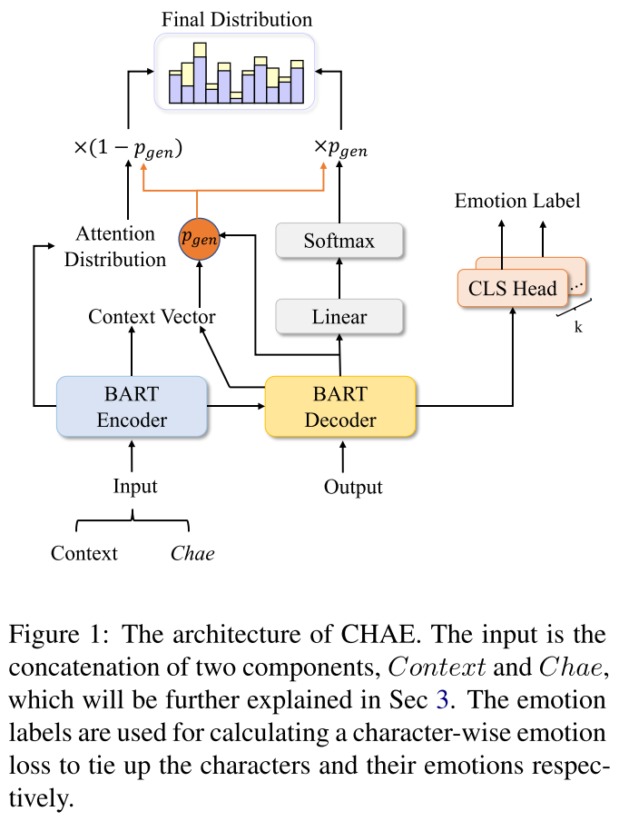
  
**results**  
- The results of both automatic and human evaluation show that our model has strong controllability to generate customized stories.
- The traditional seq2seq model SoCP has worse performance.
- the CHAE model outperforms all others.

**conclusion / future**  
- The dataset contains only stories with 5 sentences, which is not enough for learning to generate longer stories. 
- The training of our model heavily relies on the annotations of characters, emotions, and actions in the dataset, while it
is very expensive to obtain the annotated data. 
- The Chae in the dataset actually has some noise, i.e., some descriptions in Chae are not reflected in the corresponding sente nces. 
- Our iterative generation method will result in a long time to train a story and may cause a cascade problem, which affects the overall quality of story generation.

future:
- we will adopt datasets with much more data and longer stories, such as Writing-Prompts and WikiPlots2. 
- In addition, we will consider using commonsense reasoning techniques to reason about the emotions and actions of the characters in the story before further generating the story. 
- Regarding the noise of Chae, we plan to conduct denoising in preprocessing to filter out the samples whose Chae are inconsistent with the corresponding sentence. The problem can also be alleviated by dynamically controlling the weight of the conditions. 
- We are also further exploring more convenient and effective training methods to generate controllable stories by inputting control conditions in one go, rather than iterative generation.

**summary**  
- CHAE introduces Chae, a way to embed more details into the story generation process using controllable generation tokens.
- They also finetune a BART model to make the CHAE model.

**thoughts**  
- what are n-grams?
- what are special tokens for controllable gen?
- what difference the underlying arch of the LLM makes in story gen 

**testing**
they tested for:
- Perplexity which represents the general quality of the generated stories
- BLEU to compare the coverage n-gram in the candidate stories and the reference stories because the words in Chae usually appear in the reference stories.
- Distinct is used to evaluate generation diversity by calculating the percentage of unique n-grams.
- Accuracy of emotions(ACC): We use emotion labels to calculate the accuracy of  the emotions of generated sentences toreflect the controllability of emotion.

**dataset**
- ROCStory with labeled characters’ emotions and actions
- The emotions come from Plutchik psychology theory

**models**
- CHAE they developed by finetuning BART [i think]

testing with:
- GPT-2
- BART
- SoCP
- Stylized-Story-Generation (SSG)

## What Makes a Good Story and How Can We Measure It? A Comprehensive Survey of Story Evaluation
**year, subject, code**
2024, Survey, 

**background** 
- BLEU  and ROUGE are widely used, but they often fail to assess semantic aspects and show a low correlation with human judgments. 
- More recent metrics that utilize neural embeddings or generation probabilities, such as BERTScore and BARTScore, perform better in terms of semantic comprehension, but they are still not particularly effective for evaluating stories.
- Some have proposed metrics trained on human evaluation benchmarks achieving better correlation with human criteria. However, these metrics are still limited by the benchmark itself and the size of the model.
- LLM-based metrics provide evaluations that are more consistent with human judgment. 
	- Additionally, they can provide the reasoning process for the generated score, greatly improving the reliability and interpretability of automatic evaluation scores. 
	- This progress also fosters collaborative evaluation, which can leverage both the strength of human and automatic evaluation.

**problem**  
under-explored areas:
- personalized evaluation (particularly in terms of subjective aspects like empathy and interestingness), 
- long story evaluation

**solution**  
Our survey provides a comprehensive review of story evaluation. Outline:
- We first summarize the existing story generation tasks and datasets, including text-to-text, visual-to-text, and text-to-visual. 
	- also discuss evaluation considerations and challenges of various tasks.
- We outline detailed standards to evaluate stories. To address the issue of vague and inconsistent evaluation criteria, we analyze the commonly considered aspects and their definitions, which differ from general NLG tasks. 
	- We then present the existing story evaluation benchmarks and the aspects they cover.
- We describe existing metrics using the taxonomy we propose, 
	- and explore their correlation with human annotators for story evaluation. 
- We introduce a taxonomy to organize existing metrics that have been proposed or can be adopted for story evaluation. 
- We then provide detailed descriptions of traditional metrics and LLM-based metrics. 
	- we also specifically discuss the capabilities of different metrics in evaluating stories.

end of outline
- The development of automatic generation and evaluation also encourages human-AI collaborative writing and evaluation. we discuss the collaborative evaluation, and the methods for measuring collaborative writing systems.
- we recommend potential future research directions in story evaluation, which can also be extended to general domain.

**results**  
Story generation:
- stories generated with:
	- Title/Topic
	- Prompt/Premise
	- Outline/Plot/Storyline
	- Other Control Signals
- **problem** of plot repetition / incoherence **solved** with hierarchical generation process (user gives or app makes outline first, then generates based on that)

Common aspects used for evaluating story quality and their definitions:
- common ones are in the table below
- others that might be needed in specific situations are:
	- Style. can be simplified as a specific emotion or sentiment, and evaluated by style classification accuracy.
	- Controllable Accuracy. such as scene descriptions and character relationships
	- Toxicity. rude, unreasonable, or disrespectful components.
	- Naturalness/Human-like. is the story likely to be written by a human?
	- Non-Hallucination. does story contain unreasonable information that cannot be supported by the source input?
	
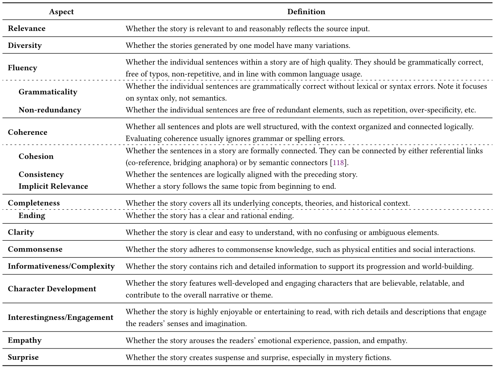

Taxonomy of evalutation metrics:
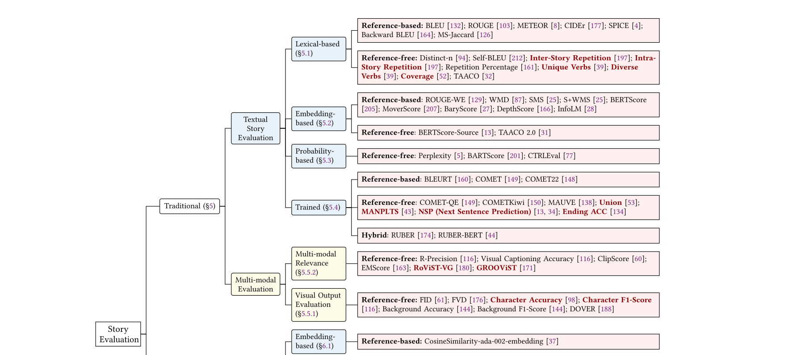
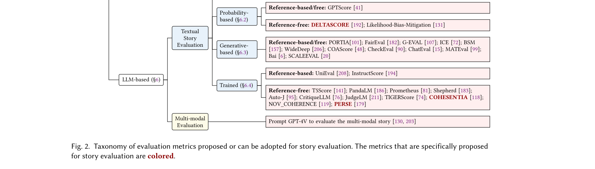

Different types of neural models for automatic evaluation metrics:
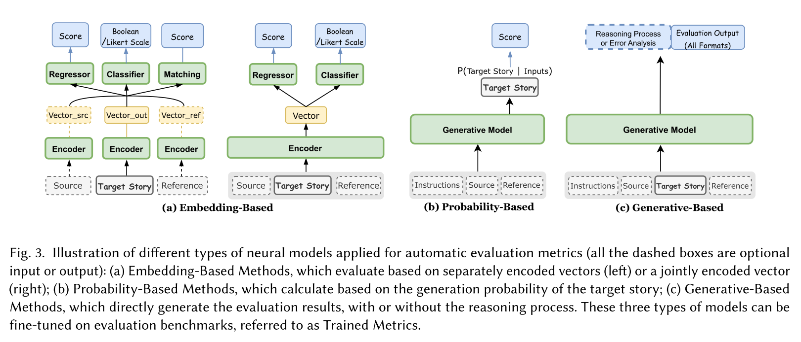

Evaluation methods:
- Lexical-Based. Such methods process the story as bag-of tokens or n-grams (n continuous tokens). They are usually used to measure the similarity between two stories or to assess the diversity of stories generated by one model.
- Embedding-Based. some embedding-based approaches use pre-trained models to encode the source input, target story, and its reference as multiple embeddings, then perform further processing.
- Probability-Based. These types of methods calculate the evaluation score based on the generation probability of the target text through generative models.
- Generative-Based. aka prompt-based methods. They provide humans or generative models with an evaluation prompt and collect the generated results.
- Trained. These methods might employ any of the three model types from the table above, with further training on evaluation benchmark datasets to improve the evaluating abilities.

Evaluation metrics, tested story aspects, working methods, and output formats:
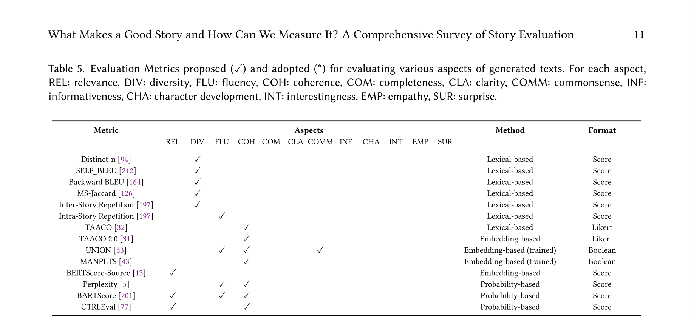
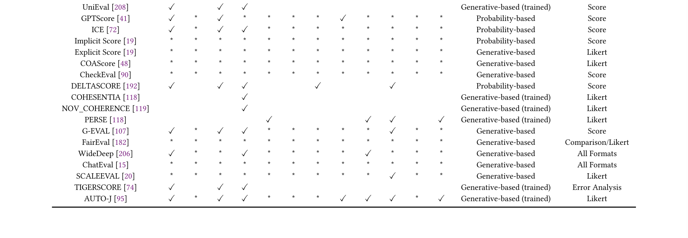

**conclusion / future** 
- Note that most story-related generation tasks do not have a standard result.
Therefore, while **reference-based** metrics (comparing target text to reference text) can be useful, **reference-free** metrics (evaluating target text based on its overall or multi-aspect quality) may be more appropriate. There are also some **hybrid** metrics that combine reference-free and reference-based results.

helpful strategies:
- In the evaluation prompt, clear and concise instructions are better than complex ones 
- Generating the reasoning process or detailed error analysis can aid the final evaluation.
- Decomposing a complicated task into simpler, clearer sub-tasks is helpful. 
- Aggregating multiple evaluations incorporating a debating process, and using multi-agent assessment can all improve the performance and robustness of the results. 
- In-context learning could be helpful especially for personalized evaluation.

There are four types of discovered biases: 
- Format Bias, which means the optimal performance is only achieved under specific prompt formats. 
	- Designing more professional prompts or fine-tuning the model with more diverse instructions can mitigate this problem. 
- Position bias, a common problem in LLM-based evaluations, which means that LLM exhibits a preference for the first displayed candidate 
	- To address this problem, a simple solution is to combine evaluations using different sample orderings. Specifically for generative-based methods, Wang et al. aggregates results across various orders to determine the final score; for trained methods, Li et al. change the order of the candidates within each training sample to double the training data. 
- Knowledge bias, which means LLM-based evaluators tend to favor the results they have seen or results that are generated by themselves. This can be partially mitigated by replacing proper nouns, but it remains a very challenging issue. 
- Likelihood Bias, which is showcased in probability-based methods, because the probability of a sentence can vary due to superficial differences, especially in aspects like relevance.

end of discovered biases.

- Open-source metrics that show comparable results to ChatGPT are preferable alternatives. Specifically, metrics trained for story evaluation such as Union, or evaluation expertise LLMs like TigerScore and AUTO-J are worth considering.
- Evaluating collaborative writing requires consideration of both story *quality* and *user experience*. 
	- Quantitative evaluations of human experience include edit distance, percentage of accepted suggestions or applied model-generated stories, generation productivity (words written per unit time), and story completion time. 
	- Lee et al. apply the concepts from Storch, redefining equality as the even distribution of writing events between humans and AI, and mutuality as the proportion of user-system interactions among all operations.
	- User feedback might be more important for evaluating collaborative writing systems. Several studies have developed questionnaires to gather this feedback. These questions either assess the overall performance (whether the framework is a good platform and if they would use it again); or assess multiple aspects, focusing on the helpfulness, user-friendliness, user experience, and effectiveness of the collaborative writing framework.
- exploring methods for effective subset sampling so humans can evaluate few useful stories from large datasets in a way that we can use to train / automate their preferences.
- look into personalised evaluation which solves the inter-annotator agreement problem. the evaluation will match the user giving initial preferences.
- Explore the Difference between Human-written and AI-generated Stories.
	- to explore the gap between AI-generated and human-written stories in order to enhance the quality of generated content. 
	- to develop methods for distinguishing between AI-generated and human-written stories, with the aim of preventing potential harm, such as the spread of fake news stories.

Some of the many ways to measure user experience in collaborative writing:  
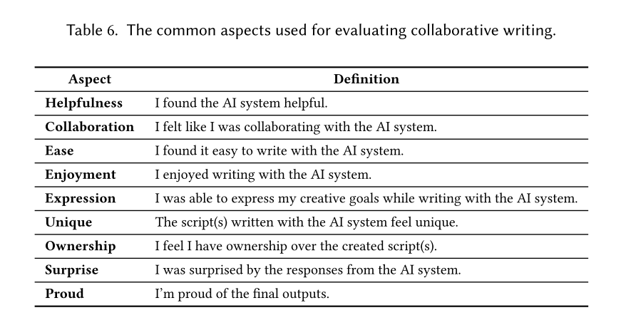

**summary** 
- Although LLM-based evaluations achieve much better results than traditional methods, there is still a long way to go in realizing reliable and robust evaluation.
- UniEval and COMET22 trained on human eval, show even stronger results than some reference-based LLM metrics.

**thoughts** 
- look into metrics trained on human evaluation benchmarks. is it true that basing them on human evaluation gives better correlation?
- what if we have a culture vector insitantialised by the person? Imagine the vector as a multi-segment line, with each point on the line being a cultural proxy. Can we use that vector as the ground truth, and the closer a generated story's vector points are to it, the more culturally good the story is.
- how can we structure story gen around character development, and use that as evaluation too? since it's what drives the story progression and is what's important at the end of the story.
- look into the helpful strategies of LLM evaluation from the **future** section.
- maybe reference-based metrics for details and reference-free for bigger picture/creativity.
- look into collaborative evalutation COEVAL and EvalLM
	- one of those metrics for evalutating the story *quality*
	- and questionares for evalutating the *user experience* (see **future** section)
- on personalised evaluation, would we take the preferences of the patient, HP, caretaker, or other? to determine whether the story is good.

**dataset**

Detailed statistics of existing story generation datasets:
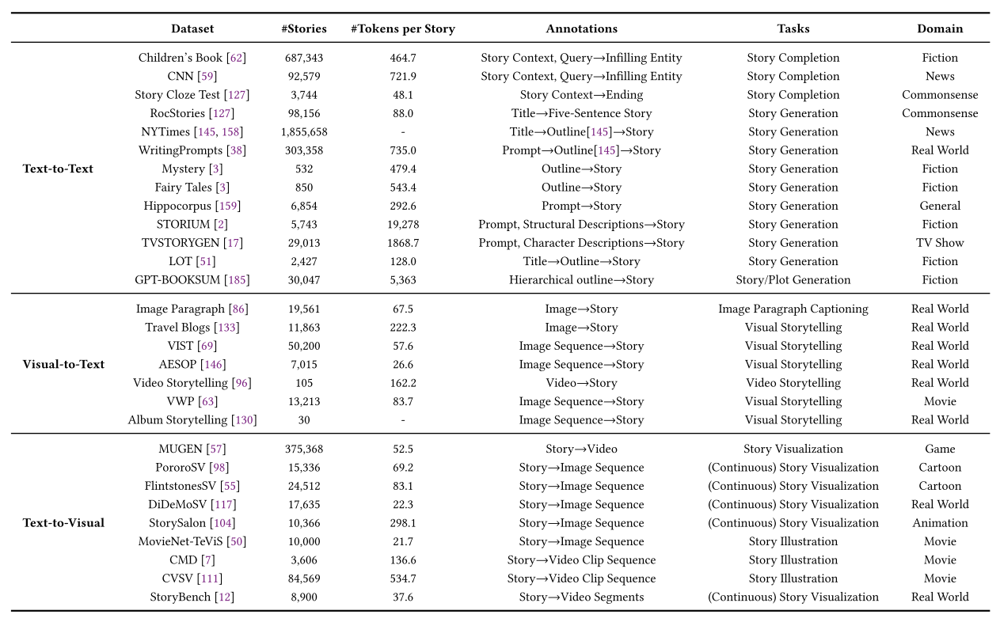

Story evaluation benchmark datasets:
- OpenMEVA propose evaluation on overall quality,
- HANNA annotates evaluation scores on multiple aspects of a story. 
- COHESENTIA firstly introduces a benchmark for the vague aspect of coherence, 
	- evaluating both global and local coherence (scoring sentence by sentence). 
- PERSE firstly focuses on personalized story evaluation, considering the readers’ personal preferences.
- see table below:

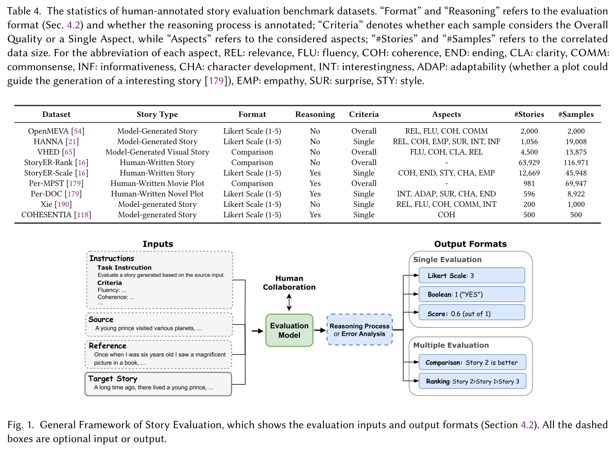

**models**

There are several since it's a scoping paper.

## M5 -- A Diverse Benchmark to Assess the Performance of Large Multimodal Models Across Multilingual and Multicultural Vision-Language Tasks
**year, subject, code**  
2024, Benchmark and testing Datasets, 

**background**  
- We have benchmarks for LLMs.
- Proprietary models:
	- GPT-4 (Achiam et al.,2023), 
	- Claude (Bai et al., 2022), 
	- Gemini (Anilet al., 2023)
	- (LMM) GPT 4V (OpenAI, 2023), 
	- (LMM) Gemini Pro V (Anilet al., 2023),
- open-source variants 
	- Llama (Touvron et al., 2023),
	- Phi (Gunasekar et al., 2023; Abdin et al., 2024), 
	- Mistral (Jiang et al., 2023)
	- (LMM) LLaVA (Liu et al., 2023a,b)
- how LMMs work:
	- a pretrained generative LLM as the core, 
	- a pretrained vision-encoder model that computes semantically rich image embeddings, 
	- and a shallow mapping network that learned to project image embeddings into the text embedding space.
- other LMM architectures (on processing image embeddings):
	- Cross-Attention (Wang et al., 2023; Bai et al.,2023), 
	- Q-Formers (Li et al., 2023; Geigle et al.,2023), 
	- Adapters (Eichenberg et al., 2022), 
	- or Preceiver Resamplers (Alayrac et al., 2022; Awadallaet al., 2023) to process image embeddings.
- LLM evaluation benchmarks (mono and multi lingual):
	- Popular benchmarks like BIG-Bench (bench authors, 2023), 
	- HELM (Liang et al., 2022), 
	- or MMLU (Hendrycks et al., 2020) are the defacto standard to evaluate LLMs on text-only tasks primarily in English. 
	- Efforts like MEGA, 
	- MEGAVERSE, 
	- or MultiQ (Ahuja et al., 2023a,b; Holtermann et al., 2024) add a large set of diverse languages
- LMM evaluation:
	- MMMU (Yue et al., 2023), 
	- MME (Fu et al., 2023),
	- or MMBench (Yuan et al., 2023) assess the performance of LMMs on a vast number of text-image tasks.

**problem**  
We don't have benchmarks for LMMs (Large Multimodal Models) that are:
- multimodal
- multilingual

**solution**  
- M5 a comprehensive benchmark to evaluate LMMs on diverse vision-language tasks within a multilingual and multicultural context. M5 includes eight datasets
covering five tasks and 41 languages, with a focus on underrepresented languages and culturally diverse images.
- Two new datasets:
	- M5-VGR
	- M5-VLOD Visio-Linguistic Outlier Detection

**results** 
**conclusion / future** 
**summary** 
**thoughts** 
**dataset**
**models**

**M5 paper not finished reading - it doesn't apply to me yet**

## ValuesRAG: Enhancing Cultural Alignment Through Retrieval-Augmented Contextual Learning
**year, subject, code**  
2025, 

**background**  
- LLMs have cultural bias based on training data

**problem**  
- While some countries have developed localized LLMs, such as China’s ERNIE [Sun et al., 2021], ChatGLM [GLM et al., 2024], DeepSeek [Liu et al., 2024a], and South Korea’s HyperCLOVA [Yoo et al., 2024], these models also exhibit biases inherited from their respective training datasets.
- Recent studies have proposed several approaches, such as role-assignment approaches [Tao et al., 2024] 
- and few-shot learning techniques [Choenni and Shutova, 2024]
- Role assignment is still relying on training data so not helpful.
- Few-shot learning struggles to capture complex cultural values due to limited correlation btn different values dimensions.
- Both RA and FSL work for single individual's values, which can't represent universal values of similar individuals.

**solution**  
-  a novel framework that utilizes Retrieval-Augmented Generation (RAG) and In-Context Learning (ICL) to dynamically incorporate cultural knowledge during text generation.
- leveraging the World Values Survey (WVS) dataset [Haerpfer et al., 2022]
- We randomly select 20% (52 questions) per topic for validation and use the remaining 80% (207 questions) for summary generation. 
- The 31 demographic features, including country, sex, age, education, social class, and employment status, are used to generate demographic summaries for retrieval tasks.
- they also do Retrieval-based Values Alignment which I don't understand.

**results**  
- outperforms SOTA LLMs that rely on RA and FSL.
- 21% benefit in performance.

**conclusion / future**  
- we plan to explore more adaptive retrieval strategies that can better align with novel datasets, 
- as well as investigate how integrating additional fine-tuning with retrievalaugmented generation may further refine each agent’s contextual accuracy.

**summary**  
- using WVS as a ground truth data for cultural differences, ValuesRAG supplements LLM prompts with cultural summaries that help it respond with cultural awareness.

**thoughts**  
_their stuff:_
- Methods like RLHF [Shen et al., 2023; Ji et al., 2024] are very commonly used in LLM values alignment, but this type of single values alignment method is not that suitable for the mitigation of cultural bias, because the alignment goal of cultural bias is diverse and dynamic [Huang et al., 2024]
- Tao et al. [2024] adopted national and cultural role assignments to adjust the cultural values of LLMs, while Masoud et al. [2024] developed a soft prompt tuning approach to mitigate bias. Also, Choenni and Shutova [2024] employed few-shot in-context learning to align cultural behaviors, demonstrating promising results in specific contexts. However, these approaches face significant limitations in fully capturing the complexity of cultural alignment. 
_my stuff:_
- can we understand how they sliced VSM data? can we use it to do a benchmark study on LLMs understanding of culture (already done), and how far away from different cultures they are? (is it useful?)

**dataset**
- World Values Survey
- plus 6 others that are culture/context specific [shown below]
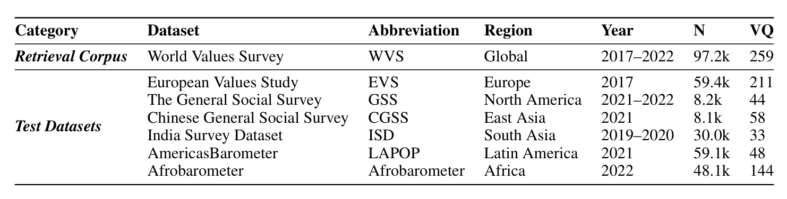

**models**
- SOTA models: Gemini Flash, GPT-4o

## Do Language Models Enjoy Their Own Stories? Prompting Large Language Models for Automatic Story Evaluation
**year, subject, code**  
2024, TACL, https://github.com/dig-team/hanna-benchmark-asg

**background**  
- storytelling is complex.
- automatic story evaluation (ASE and generation are complex.
- LLMs are good at NLP tasks.
- ASG "provides listeners with an engaging and instructive experience (Miller and Pennycuff, 2008)."
- "LLMs are now able to produce convincing stories, so much so that they can be hard to distinguish from human stories (Clark et al., 2021)"

on Prompt engineering:
- Reynolds and McDonell (2021) notably find that zero-shot prompting can perform similarly to few-shot prompting, and even exceed it. 
- They also explore the design of metaprompts that prime the language model to better solve a given problem.
- Zhou et al. (2023b) treat the prompt engineering process as an optimization problem, use search algorithms guided by LLMs to solve it and attain human-level performance.
- Wei et al. (2022a) and White et al. (2023) review different strategies that have been applied to augment large language model abilities, e.g., 
	- least-to-most prompting (Zhou et al., 2023a), 
	- ask-me-anything prompting (Arora et al., 2023), 
	- and zero-shot chain-of-thought reasoning (Kojima et al., 2022).

**problem**  
- "human annotation of stories is costly and time-consuming (Celikyilmaz et al., 2020)"
- current automatic measures have been shown to be poorly correlated with human judgment for ASG (Chhun et al., 2022)

**solution**  
contributions:
- A comparison between LLMs and current ASE measures.
- An analysis of the influence of prompt engineering on LLM performance.
- Insights on LLM explainability for ASE.
- An analysis of LLM performance in ASG. 

methodology:

This study uses zero- or one-shot Eval-Prompts.
Given the importance of good prompt engineering (Zhao et al., 2021), they design four different Eval-Prompts for the generation of ratings. For each Eval-Prompt, they provide the model with a story-prompt and a corresponding story. Then:
- Eval-Prompt 1 (simple rating): they ask the model to rate the story on a scale from 1 to 5 on one of the six criteria;
- Eval-Prompt 2 (rating with explanation): same as Eval-Prompt 1, and they ask the model to explain its answer;
- Eval-Prompt 3 (rating with explanation and guidelines): same as Eval-Prompt 2, and they provide the model with the detailed guidelines from the original annotation protocol by Chhun et al. (2022);
- Eval-Prompt 4 (rating with explanation and human story): same as Eval-Prompt 2, and they provide the model with the human story associated with the same story-prompt. they explicitly tell the model that the human story is given only for reference purposes.
- **important to note** they have statistical reasoning (beyond p-values) for averaging their results. very good to see. very good to review when I will need it.
- they also did a user study to rate the LLM explanations.

**results**  

- consistency: LLMs have very high consistency overall, over all criteria 
- correlation: Overall correlations remain weak, although LLMs display marginal improvements over non-LLM automatic measures, backed with strong statistical evidence. At the system-level, LLM correlations with human judgment are high, but statistical evidence is weaker.
- LLM explanations: asking for explanations has negligaible effect on ratings.
- giving LLM guidlines for eval lowers correlation, but providing a human story for ref increases correlations.
- LLMs often struggle with following guidelines and substantiating their explanations.
- LLMs good at short stories 500 to 1000 words.
- LLMs are currently the best proxy for human story evaluation.
- LLM stories have at least equal ASE ratings to human stories - they create stories that are just as good as those humans create.
- Pretraining data == better ASG. the larger the LLM, the better the quality.

**conclusion / future**  

- Bubeck et al. (2023) argue that LLMs do display impressive performance at a wide variety of tasks but lack “slow thinking” capabilities, referring to the System 1–System 2 dichotomy introduced by Kahneman (2011).
- they hypothesise that if the story follows good formal quality (vocabulary, syntax, grammar), it will be rated highly by the LLM and human because both associate good stories with being well-written. 

**summary**  

The writers used the HANNA dataset. They generated more stories from new LLMs, and then evaluated all stories using the 6 human criteria but using LLMs. They found that LLMs can evaluate similar to humans, but lack explanations.

**thoughts**  

- I misunderstood. I thought 500 - 1000 was long, but that's what they've used and are calling it short. so no need for long story eval (need is there, but out of my scope)
- in the results section, what's the difference between correlations found and statistical evidence backing them? why is the stat evidence important?
- can we get highly-ranked stories from HANNA and make them badly written? and see if the LLM and people will still consider them good?
- can we explore System 1-System 2 thinking? apparently LLMs do System 1 so they just skim, they can't really understand or explain what a good story is.

**dataset**

- HANNA
- for LLMs: CommonCrawl, Books1 and Books2

**LLM models**

old:

- BERTGeneration (Rothe et al., 2020), 
- CTRL (Keskar et al., 2019), 
- GPT (Radford et al., 2019), 
- GPT-2 (Radford et al., 2019), 
- RoBERTa (Liu et al., 2019), 
- and XLNet (Yang et al., 2019); 

new:

- Llama-2-7b-chat-hf (Llama-7B)
- Platypus2-70B-instruct (Platypus2), 
- Llama-30b-instruct-2048 (Llama-30B), 
- StableBeluga-13B (Beluga-13B), 
- and Mistral-7B-OpenOrca (Mistral)

**ASG-specific models** 

- Fusion (Fan et al., 2018), 
- HINT (Guan et al., 2021), 
- and TD-VAE (Wilmot and Keller, 2021).

**evaluation models**

- BLEU (Papineni et al., 2002), 
- ROUGE (Lin, 2004), 
- chrF (Popović, 2015), 
- BERTScore (Zhang et al., 2020), 
- SUPERT (Gao et al., 2020), 
- BLANC (Vasilyev et al., 2020), 
- BARTScore (Yuan et al., 2021), 
- BaryScore (Colombo et al., 2021).

## 
**year, subject, code**
**background**
**problem**
**solution**
**results**
**conclusion / future**
**summary**
**thoughts**
**dataset**
**models**

