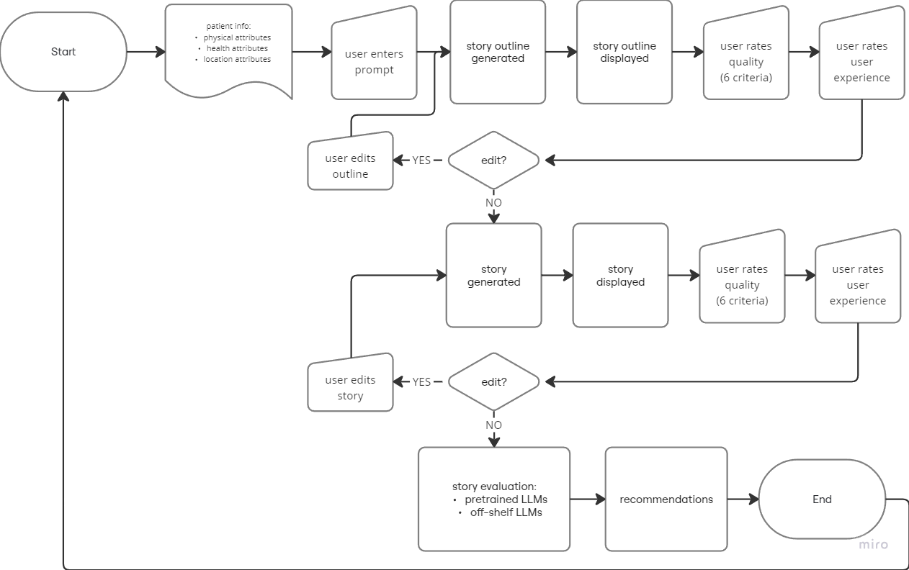

# Study 1: Are there patterns to find between GenAI stories and User edits?

## Introduction
Generative Artificial Intelligence (GenAI) models such as Large Language Models (LLMs) have proven useful in text generation. Because of this, we explore their use in story generation. We aim to enable Type 2 Diabetes (T2D) patients, carers, and healthcare providers generate fictional stories with specific aims such as motivation. These stories are intended to be an addition to their existing T2D management strategies.
The real-world context is Africa (South Africa and Kenya), and we hope the findings can enable users worldwide to generate more contextually-aware content with GenAI models.

## Current system
In the current implementation, the user prompts the system and it generates a story based on the prompt. From there, the user gives feedback on the story and it is regenerated accordingly. This happens until either the user is satisfied with the result, or settles for the result due to constraints in time, interest, benefit of doubt, etc. The user can then generate images based on the story (and associated prompts) generated. This image generation part is not part of the scope of this study.

## The gap
- There is no way for the system to *learn* the preferences of the user.
- There is no collection nor analysis of the preferences of the user.
- Each generated story must undergo edits from the user to make it acceptable to them.

## The benefits
- Understanding the difference between the AI output and what the user accepts can help us augment the system so that future outputs are closer to what the user wants. 
- Trying to measure these differences can help us make structures useful for filling in the gaps that AI has when making context-relevant output.

## The experiment
The aim of the study is to capture the changes and feedback made to the system. We then analyse this and use it to make changes to the system that make it better. This experiment therefore proposes an iteration of the system that:
- *(new)* generates a story outline first.
- *(new)* the outline can then be edited and/or approved by the user
- *(new)* the system collects feedback from the user on the changes made
- the actual story is then generated.
- the story can also be edited by the user until it is acceptable to them.
- *(new)* the system collects feedback from the user on the changes made
- *(new)* after the workflow, the changes and feedback from the user are analysed.

The diagram shows the flow of the proposed system:
<!--  -->

The experiment details for input (patient and prompt details) and output (output and evaluation details) are presented below:
### patient
Patient attributes are required to generate relevant stories for them. The goal is to find a balance between patient confidentiality and useful detail. Searching for that balance could be a separate study. This study takes collects the following information from the patient:
- Physical attributes: needed for story and image generation
    - age range
    - gender
    - ethnicity
    - body shape/size range
    - disability & mobility accessories
    - (optional) bonus details: hair, dress style, accessories, etc
- Health attributes: to ground the story generation in patient's current health situation
    - health status
    - previous health recommendation(s)
    - current health recommendation(s)
- Location attributes: to place the story generated in patient's locations
    - common locations: home, school/work
    - important locations: religious, social, commercial, cultural, lifestyle

*In the future:* We could also consider generating patient personas from the Official South African national T2D data.

### prompt
The prompt portion covers both the outline and story generation and refining. The outline is a nested list of story parts. Each part is a summary that is used to generate the full story portion. We can modify the CHAE (CHaracter, Action, Emotion) idea to include the Setting. CHASE is:
- CHaracter: the patient
- Action: the suggested action for that part of the story
- Setting: the location of the event
- Emotion: the patient's emotion during the event

*In the future:* We could consider commonsense reasoning techniques / agents to generate and verify the outline before presenting it to the user.

### output
The primary output is the story the user requested.

Other outputs that are useful are:
- the story outline useful for getting the facts right before generating the full story
- the user feedback from the generated outline
- the user feedback from the generated story

## The evaluation
The evaluation of the system will hopefully shed some light on how we can close the gaps mentioned above. An evaluation approach from literature is to evaluate both the story and user's experience. 
### story evaluation
We'll use two types of metrics, RB and RF. RB are reference-based metrics so we'll compare their output to a ground truth. RF are reference-free and we'll measure those without ground truth. Literature suggests evaluating the story based on 6 criteria (6C) that cover the different ways to present culture in stories. These are:
- Relevance (RE): how well the story matches its prompt. RB
- Coherence (CH): how much the story makes sense,. RF
- Empathy (EM): how well the reader understood the character’s emotions, derived from the importance of emotional commentary, passion , and empathy. RF
- Surprise (SU): how surprising the end of the story was, derived from the importance of schema violation, or unexpectedness, postdictability, and novelty. RB
- Engagement (EG): how much the reader engaged with the story; a more subjective criterion associated with projecting volitive modality (making the reader formulate a subjective judgment and express a desire to see something accomplished) and story outcome, which is an underlying cause of story liking. RB
- Complexity (CX): how elaborate the story is; derived from the importance of detailed descriptions and sophisticated problem-solving and good world-building. RB

**questions to ask:**
Consider the output to be the outline and the story. All scale questions are Likert 1-10 and sample answers *"look like this"* Evaluation questions are:
- Relevance (RE): 
    - how closely-matched is output to prompt? *e.g. "9/10 the story matches the prompt."*
    - why? *e.g. "I asked for a story on exercising at home and it gave me that."*
- Coherence (CH): 
    - how much does the output make sense? (how correctly does output flow? a leads to b to c) *e.g. "5/10 story makes some sense but not entirely."*
    - what parts show you that it makes sense? (parts == transitions, events, etc) *e.g. "the part about her exercising makes sense, but she wouldn't exercise during work hours."*
- Empathy (EM): 
    - how much does (health+context) ground truth influence emotions in the output? *e.g. "7/10 she would definitely be sad to learn she has T2D and it's for life."*
    - how much does reader understand/identify that relationship? *e.g. "T2D means she'll have to change her lifestyle to manage it, which will be hard or uncomfortable"*
- Surprise (SU): 
    - does output have novelty in finding a solution/resolution? (should be based on health+context ground truth)  *e.g. "2/10 I like that in the story, he goes to a gym near home, but I don't think he'd afford it longterm."*
    - why? *e.g. "He wouldn't afford it. Gyms are costly and even though he's rich, his extended family needs limit his cash."*
- Engagement (EG): 
    - did reader form their own opinion, based on the output? how much does reader agree / disagree? *e.g. "10/10 I liked that she told her sisters and they helped her work on getting healthy!"* or *"1/10 She shouldn't go on evening walks, it's so dangerous!"* or *"5/10 The story's okay, not bad, not good. But yea, I wouldn't share it on my Whatsapp or anything."*
    - why? *e.g. "It's better for her to have a support system."* or *"I dont know... It's normal life, nothing exciting. Hence the 5/10 rating."*
- Complexity (CX): 
    - how much [CHaracter, Action, Setting, Emotion] detail is in the output? *e.g. "7/10 Character is good, 9/10 health Actions seem good, 5/10 Setting is good but generic, 8/10 Emotions match the events."*
    - how much problem-solving is in the output? *e.g. "4/10 she needs to exercise so a gym is suggested, obviously. But a personal trainer is better since she's dealing with T2D not just exericising."*
    - why? *e.g. "Gyms have majority healthy people, so their programs are based on those. For T2D, she'd need more specific attention so she doesn't cause more health problems."*

**analysis of the answers:**

The literature shows that LLMs are already used for evaluating stories. They can provide some 'reasoning' in many cases. They do require concise instructions. Giving them ground truths for evaluations, rather than rely on their training data helps with the bias problem.
Another option are pre-trained evaluation LLMs built specifically for such tasks. Some examples are AUTO-J and TigerScore. UniEval and COMET22 are better than off-the-shelf LLMs in some cases.  
To analyse the answers, we will:
- gather 6C feedback from the user
- gather 6C feedback from the LLM
- compare the two sets for patterns.
    - after gathering user and LLM 6C feedback, how do I do the comparison?
        - LLMs can give us ratings on which is better.
            - we run this through [1] the LLM generating the story and [2] other StoryEval LLMs (Add DeltaScore for fine-grained evaluations).
        - Then we show these results to the user with their accompanying explanations
            - the user agrees/disagrees with the LLMs' reasons (Likert 1-10), similar to COEVAL but better. 
            - we also ask "why" to collect the qualititative feedback.

From the above, we can get:
- which criteria of the output are lagging behind (and gather more from the user/domain on those)
- how those criteria are lagging behind (lack of info/detail, or irrelevant info/detail?)
- which criteria are more useful to the user (🤔how can we have the user rank them?)
- the difference between the LLMs' output and the user's accepted output. (correlation?)
- the difference between the LLMs' and the user's evaluations. (correlation?)
- the difference between the user feedback and the user's typed edits. (correlation?)
- and other useful insights.

### user experience evaluation
The most important benefit of the user experience feedback is the reasoning process behind the decisions/changes they make to the outlines and stories. There are a number of questionnaires we can adapt to collect this information from them. It will contain feedback on both the generated content and the experience of using the system. 

**analysis of the answers:**

For now, we'll use these from Mirowski et al. We'll rate them on a Likert 1-10 and ask why to get qualitative feedback too:
- Helpfulness: I found the AI system helpful.
- Collaboration: I felt like I was collaborating with the AI system.
- Ease: I found it easy to write with the AI system.
- Enjoyment: I enjoyed writing with the AI system.
- Expression: I was able to express my creative goals while writing with the AI system.
- Unique: The script(s) written with the AI system feel unique.
- Ownership: I feel I have ownership over the created script(s).
- Surprise: I was surprised by the responses from the AI system.
- Proud: I’m proud of the final outputs.

### automation ideas [future work]
#### personas
Can we then automate persona generation (like S2P paper). These patient personas would be a starting point for app users to select as an avatar, and customise later. They help with data privacy and yet enable the system get the information it needs to generate useful stories over time. These can be generated from:
- the official South African national T2D data.
- user feedback that is collected over time.

#### outline and story generation
This process can later be improved by using multi-agent working. Here, each agent can be responsible for a particular part of the output or metric, and communication between them ensures final outputs are compliant with the many demanding requirements. These would also be useful for evaluation. Specific user feedback can also go directly to the relevant agent.  