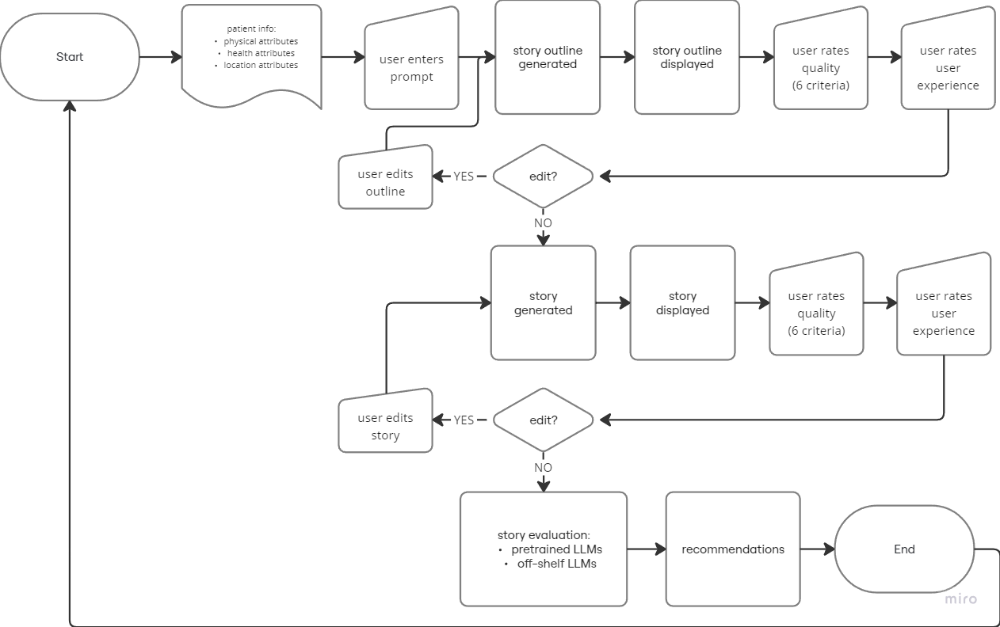

# Workplan

## 1: (Study) Are there patterns to find between GenAI stories and User edits?

**Introduction**

Generative Artificial Intelligence (GenAI) models such as Large Language Models (LLMs) have proven useful in text generation. Because of this, we explore their use in story generation. We aim to enable Type 2 Diabetes (T2D) patients, carers, and healthcare providers generate fictional stories with specific aims such as motivation. These stories are intended to be an addition to their existing T2D management strategies.
The real-world context is Africa (South Africa and Kenya), and we hope the findings can enable users worldwide to generate more contextually-aware content with GenAI models.

**The gap**
- There is no way for the system to *learn* the preferences of the user.
- There is no collection nor analysis of the preferences of the user.
- Each generated story must undergo edits from the user to make it acceptable to them.

**The benefits**
- Understanding the difference between the AI output and what the user accepts can help us augment the system so that future outputs are closer to what the user wants. 
- Trying to measure these differences can help us make structures useful for filling in the gaps that AI has when making context-relevant output.

**The experiment**

The aim of the study is to capture the changes and feedback made to the system. We then analyse this and use it to make changes to the system that make it better. This experiment therefore proposes an iteration of the system that:
- *(new)* generates a story outline first.
- *(new)* the outline can then be edited and/or approved by the user
- *(new)* the system collects feedback from the user on the changes made
- the actual story is then generated.
- the story can also be edited by the user until it is acceptable to them.
- *(new)* the system collects feedback from the user on the changes made
- *(new)* after the workflow, the changes and feedback from the user are analysed.

The diagram shows the flow of the proposed system:
<!--  -->

## 2: (Experiment) Long story evaluation

**Introduction**

Humans are the gold standard for story evaluation. However, the process of Human story evaluation (HSE) poses some challenges:
- HSE is often difficult because of acquiring the people to do the evaluation, and is therefore costly.
- It is difficult to find a correlation between stories evaluated by different people since each has different opinions on what 'a good story' is. Even within several stories evaluated by the same person, such differences can and do occur.

**The gap**

LLMs have been shown to evaluate stories. However, their evaluation metrics are computational (regard the complexity of the story, from a computing perpective). These methods can spot a literary-diverse story, but cannot say whether such a story is a good story.
Because of their strengths in NLP tasks, LLMs have recently been tested in Automated Story Evaluation (ASE) with human criteria rather than computational ones. They have shown promising results. However, all these experiments are working with short stories. Since our project involves medium to long stories (300 to 600 words), there is need to investigate whether LLMs can assist Humans in evaluating such stories for both 'goodness' and 'culture'

**The experiment**

The aim of this experiment is to generate and evaluate the usefulness of LLMs in ASE tasks where the stories being evaluated are longer than current methods have reported on.
We intend to:
- generate stories with the pipeline from study 1
- develop a novel pipeline for ASE
- run these stories through the pipeline and report on the results

**The results**

This experiment will help establish ways to use LLMs in ASE. This benefits the overall project because:
- it provides a way to incorporate LLMs as quality control in outline and story generation stages. This will ensure that the stories generated are of an overall better quality.
- it also provides a way to incorporate LLM feedback to the system user at the human evaluation stage. This increases the transparency of the system, clarifies LLM inclinations/bias, and helps the user make more informed decisions with the stories (and later, images) generated.